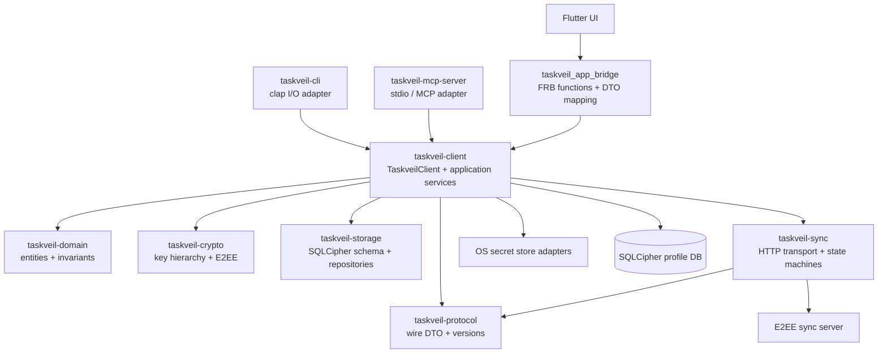

# Taskveil client / frontend adapter architecture

この文書は、Flutter bridge、CLI、MCPからRust共通実装へ入る依存境界と命名規則を定める。local profile共有の設計判断はADR-011、process間coordinationはADR-027、同期protocolの正本は`docs/03_技術仕様書.md`とする。

## 用語

- `TaskveilClient`: 1つのlocal profileを開き、account/session、application service、transaction、同期を統括するfrontend-neutralなruntime facade。ユーザー表示profileではない。
- `LocalProfile`: SQLCipher DB、OS secret store上のDevice Key参照、永続account binding、local sync stateからなる端末内のデータ・security boundary。Rustの公開runtime struct名にはしない。
- `LocalProfileConfig`: `TaskveilClient::open`へ渡すlocal persistenceの起動設定。DB directoryとbootstrap値だけを持ち、credential、server URL、session state、永続identity bindingは持たない。
- `LocalProfileBinding`: storageへ永続化するaccount / tenant identity。`LocalProfileConfig`とは別の概念である。

## 目標構成



依存方向はfrontend adapter → `taskveil-client` → 下位crateの一方向とする。Flutter、CLI、MCPはrepository、DB key、master key、tenant ID、`LocalMutationContext`、sync storeを受け取らない。`TaskveilClient`の高水準methodへtyped inputを渡し、frontend固有の入力・出力へ変換する。

## 所有責務

| 層 | 所有するもの | 所有しないもの |
|---|---|---|
| `taskveil_app_bridge` | FRB公開関数、文字列/typed input変換、Dart向けDTO変換、process内client handle | repository、SQLCipher open、鍵、account/sync state、同期順序、runtime生成 |
| `taskveil-cli` | clap、対話、表示、exit code | CRUD規則、repository、暗号、同期coordinator |
| `taskveil-mcp-server` | MCP schema、認可prompt、stdio transport、tool response | CRUD規則、repository、暗号、同期coordinator |
| `taskveil-client` | local profile open、account/session、application service、transaction境界、sync coordinator、SQLite sync adapter | Flutter/Dart/FRB、clap、MCP transport |
| `taskveil-domain` | entity、不変条件、純粋な状態遷移 | DB、network、frontend |
| `taskveil-storage` | schema、migration、repository、transaction primitive | frontend、network同期順序 |
| `taskveil-protocol` | sync/account/Organizationのserde DTO、wire enum、canonical wire value、version/constants | storage、HTTP、暗号演算、domain merge、client runtime |
| `taskveil-sync` | HTTP transport、E2EE record、merge、同期state machine/trait | Flutter、具体SQLite repository、profile UI |

## Local profile process coordination

同じlocal profileを開く複数の`TaskveilClient`は、instanceごとのmutexや
SQLite writer lockだけでなく、`taskveil-client`が所有する共通coordinatorへ収束させる。
frontend adapterはlockfile path、owner ID、lease row、DB keyを受け取らない。

lock hierarchyは次で固定する。

1. canonical profile identityで共有するprocess-local registryのshared / exclusive guard
2. OS profile advisory shared / exclusive guard
3. session credential lockまたはDB-backed sync lease
4. SQLite transaction

SQLite transaction内から上位lockを取得せず、network await中にSQLite transactionを
保持しない。通常readとlocal mutationはprofile shared guardを使う。sync runは短いshared
guard内でcapsule / runtimeを再検証してDB keyとruntime epochをsnapshotした後、最初の
network awaitより前にguardを解放する。以後のsingle-flightとcommit safetyはDB-backed
lease / fencingが担う。Tenant key cutoverもlease保持中にprofile guardを再取得せず、
fenced transactionとpost-commitのruntime epoch CASでstale publicationを拒否する。
capsule recovery、migration、account/device bindingを変更するauth / logout、
Device Key rotationはprofile exclusive guardを使い、別processの通常operation開始を止める。

profile identityは作成後のcanonical directoryから決め、DBはその配下の固定名とする。相対path、
symlink / junction、Windowsのcase差を同じcoordinatorへ収束させる。OS advisory lockが
排他の正本であり、PID、lockfileの存在、owner metadataは正本にしない。macOS / iOS、
Windows、Linux / Androidのproductionで安全なlockまたはcanonical identityを利用できない
場合は`ProfileLockUnsupported`としてfail closedにし、SQLite-onlyへ降格しない。
同一processのcoordinatorはOS lock handleを1本だけ保持し、最初のreaderでshared lock、
最後のreaderでunlockする。guardごとに別handleを開いてclose semanticsへ依存しない。
`TaskveilClient`はopen時のcanonical directory identityとDB identityをprocess lifetime中
pinし、各guard取得後にpathのidentity driftを検出する。Windowsはdelete sharingを許可しない
root handleも同じlifetime中保持し、rootに加えて既存profile lock、session lock、DBの
ownerとDACLも各handleから検証する。Unixのsame-euid processとmobileの同一app container /
App Groupはtrusted boundaryであり、group / world writableなrootまたはDBはfail closedにする。
権限を持つ悪意あるsame-UID processによるrename、unlink、ptrace等の攻撃は対象外だが、
誤操作や通常の別processによるidentity driftはoperation開始前に拒否する。

SQLCipherはprofile bindingと単調な`runtime_epoch`を保持する。各clientは
`loaded_epoch`とactive capsuleの非秘密なgeneration markerを記憶し、operation開始時と
commit前に再検証する。変更時はDB connection、DB key、account / crypto runtimeを
再読込する。account/device bindingとTenant Root Key cacheの実質的変更は、それらを
発行する`IMMEDIATE` transactionで`runtime_epoch`も更新する。device再束縛はepoch発行前に
local HLC、quarantineを含む全outbox headとaccount device markerを原子的に更新する。secret storeとDBをまたぐ
credential publication / Device Key rotationはpending / active markerを持つdurable sagaとし、
exclusive guard内でrecoveryを完了するまで通常operationを再開しない。
Tenant Root Key cacheはserverがactive / migration中として返すgeneration集合を正本に、
generationごとのMK-wrapped rowを保持する。randomized AEADのciphertext差をkey変更と
見なさず、既存rowをMaster Keyで認証付き復号したsemantic keyと比較する。同generation・
同keyはno-op、同generation・異keyはfail closedとし、migration中のhistorical generationも
再起動後の復号contextへ復元する。remote集合からretireされたgenerationは削除し、その削除も
runtime epochを更新する実質的cache変更として扱う。

sync runはowner ID、expiry、単調fencing token、取得時runtime epochを持つDB-backed
leaseを使う。有効な別ownerがいれば`SyncLeaseBusy`、renew不能、expiry、takeover、
runtime epoch変更は`LeaseLost`とする。network response後のACK、cursor、
pull apply、full-resync stateはowner、fence、epoch一致時だけcommitする。
epoch変更後に同じrunがleaseを取り直してはならず、profile runtimeとsync contextを
再解決した新しいouter operationだけが次のleaseを取得する。
local fenceは送信済みHTTP requestを取り消せないため、remote side effectは既存の
`op_id`、base revision CAS、冪等ACKで再送安全にする。
同期後のsettlementが新outboxを作った場合だけでなく、network待機中のlocal mutationが
durable outbox headを残した場合も同じrunがfollow-up drainする。完了判定はfencedな
empty-outbox readへ線形化し、それ以前にcommitしたmutationを取りこぼさない。

公開errorは`ProfileBusy`、`SyncLeaseBusy`、`LeaseLost`、
`ProfileLockUnsupported`、`DatabaseBusy`を区別する。
runtime epoch / capsule generation不一致は原則として内部reload条件にし、秘密、
credential、復号済みcontent、生profile pathをerror、log、lock metadataへ含めない。

sync readinessはprofile guard取得とruntime epoch refreshの後に一度だけ解決し、
`LoggedOut`、`Ready`、`CredentialUnavailable`、`AccountBoundUnavailable`を区別する。
`LoggedOut`だけを同期不要の正常終了として扱う。credentialの欠落、期限切れ、
invalid grantは`CredentialUnavailable`、永続account bindingに必要なlocal cryptoを
復元できない場合は`AccountBoundUnavailable`とし、secret store、DB、manifest、
暗号materialの破損をlogged-outへ変換しない。active credentialから復元した
user / tenant / device identityはlocal crypto bindingと完全一致することを検証し、
remote sessionとcredential generationは検証完了後にまとめて公開する。local crypto
runtimeの復元はremote credentialの読取・検証から分離し、credentialの欠落、破損、
secret store障害だけを理由にaccount-bound offline mutationを停止しない。
同期開始時に生成したimmutable contextをbackfill、push、pull、settlementへ渡し、
同じrunの途中でaccount runtimeを再解決しない。`ClockSkewRetryable`、
`UpgradeRequired`とprofile / database / leaseのbusy・lost分類もこの境界で保持する。

同一processの2 instance testだけをprocess間coordinationの証拠にしない。barrierで同期する
実child processを使い、stale runtime、同時mutation / sync、lease takeover、
強制終了後の回復、path alias、異なるprofileの並行性をdesktop全対象OSで検証する。
mobileで別process / App Extensionによる同一profile共有を有効にする場合は
platform instrumentation testを追加する。CLI / MCPのshared profile実接続はこれらの
release gate完了まで有効化しない。

## Fuzzy-scanの配置

- stable-key page、delta、high-water closureのwire contractは`taskveil-protocol`、mark/sweepを含むstate machine/traitは`taskveil-sync`。
- resync generation、preflight、lease、crash recovery、実行順序は`taskveil-client`。
- cursor/mark table/schema/transactionは`taskveil-storage`。
- SQLite trait adapterは`taskveil-client`。
- server current-state scanとGC horizonは`taskveil-server`。
- Flutter bridgeは`client.sync_now`と`client.sync_status`以外のFuzzy-scan実装を持たない。

このためFuzzy-scanを追加しても、FRB公開APIやFlutter側Rust adapterを変更せずに実装できることを設計レビュー条件とする。

## Foreground realtime通知の配置

ADR-019のWebSocketは同期transportではなく、foreground app lifecycleへ従う欠落可能なwake-up hintである。境界は次に固定する。

- `taskveil-client`は現在のaccount / session / tenant contextを使って短命realtime ticketを取得し、frontend-neutralな`RealtimeTicket`として返す。session token、tenant ID、device ID、HMAC keyをfrontendへ公開しない。
- `taskveil_app_bridge`はticket DTO変換とasync委譲だけを持つ。WebSocket、reconnect timer、sync scheduler、HTTP client、secretを保持しない。
- Flutterはforeground / background lifecycle、WebSocket接続、ticket refresh、reconnect backoff、notification frame decodeを所有する。frameからdomain / sync stateを解釈せず、固定`changed` hintを受けたら既存`sync_now`をrequestする。
- sync対象local mutation後の250ms debounce、single-flight dirty follow-up、接続中5分safety pull、切断中30秒fallback pollingもFlutter runtime orchestrationとする。CAS、merge、cursor、outbox ACK、continuityは引き続き`taskveil-client` / `taskveil-sync`だけが所有する。
- remote pull適用後は既存`SyncStatusNotifier`からlist / task / Home / Calendar / search / timer providerをinvalidateし、domain stateをWebSocket frameから組み立てず通常のrepository readでUIを更新する。
- CLI / MCPへWebSocketを強制しない。必要になった場合も`RealtimeTicket`を共通入口とし、各frontend lifecycleに適したadapterを別途実装する。

この配置はFlutterへ同期correctnessを移さない。WebSocketを完全に削除しても、明示sync、resume sync、fallback pollingと既存HTTPS state machineだけで最終収束することをレビュー条件とする。

## crate命名

`core/`はCargo workspace内の配置ディレクトリで、crateではない。次を正規形とする。

```text
directory:     core/<role>
Cargo package: taskveil-<role>
Rust import:   taskveil_<role>
```

`[package] name = "core"`、`[lib] name = "core"`、dependency alias `core = { ... }`、曖昧なumbrella `taskveil-core` crate、雑多なroot module `mod core`を追加しない。Rust標準の`::core`と名前を競合・混同させないためである。

`taskveil_app_bridge`はCargo package、lib target、FRB stem、pod名が一致する既存のビルド契約なので改名しない。

## レビューと機械的check

新しいfrontend機能は次の順で実装する。

1. `taskveil-client`へfrontend-neutralなinput/output/errorとapplication serviceを追加する。
2. domain/storage/syncをまたぐtransactionと回帰testをclient側で完成させる。
3. Flutter/CLI/MCP adapterへ薄い入出力変換を追加する。

`sh app/tool/check_client_boundaries.sh`はfrontend manifestの直接依存、bridge sourceの禁止import、bare `core` crate/aliasを検査する。Cargo compileだけでは検知できない境界の意図をCIで固定する。

task-92で`app/rust/src/support.rs` / `sync_store.rs`を削除し、application/local profile責務を当時の`ClientProfile`へ全面移設した。task-93でnetwork FRB関数もasyncへ統一し、bridge内blocking executorを削除した。task-94でruntime facadeを`TaskveilClient`、起動設定を`LocalProfileConfig`、内部transaction primitiveを`SqliteMutationService`へ改名し、旧名aliasを残さず役割を分離した。bridgeの通常依存はFRBと`taskveil-client`だけで、Taskveil workspace内依存はclientのみであり、legacy exceptionは存在しない。CIは下位crate参照0、runtime生成0、削除済みmoduleの再作成禁止、manifest allowlistを検査する。Fuzzy-scanはこの境界を変えずに`taskveil-sync` / `taskveil-storage` / `taskveil-client` / serverへ実装する。

Networkを伴うaccount/sync APIは`TaskveilClient`とFRBの両方でasyncとし、Futureを直接awaitする。Flutter/Dart、CLI、MCPの各runtime内で自然に実行し、adapterやclientがnested runtimeを生成しない。低水準の`SqliteMutationService`、`LocalMutationContext`、SQLite sync store、local crypto helperは通常public APIではなく、server統合testが`test-support` featureを明示した場合だけ利用できる。
